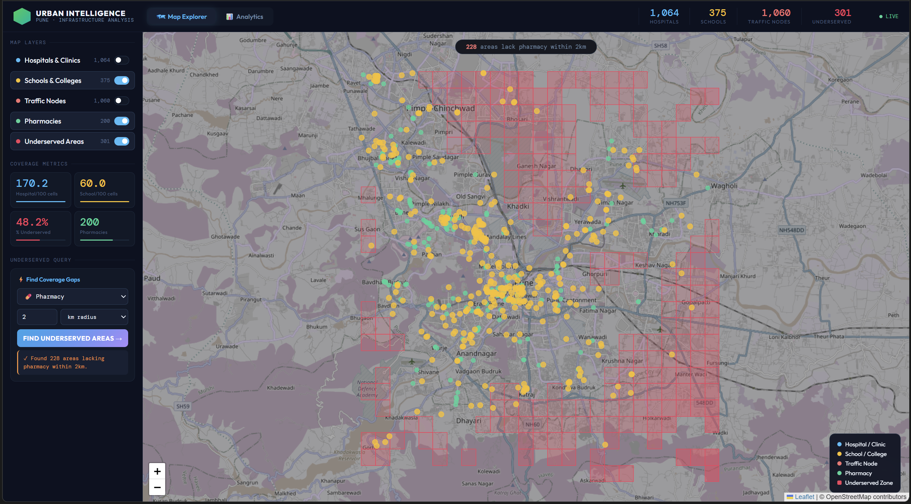
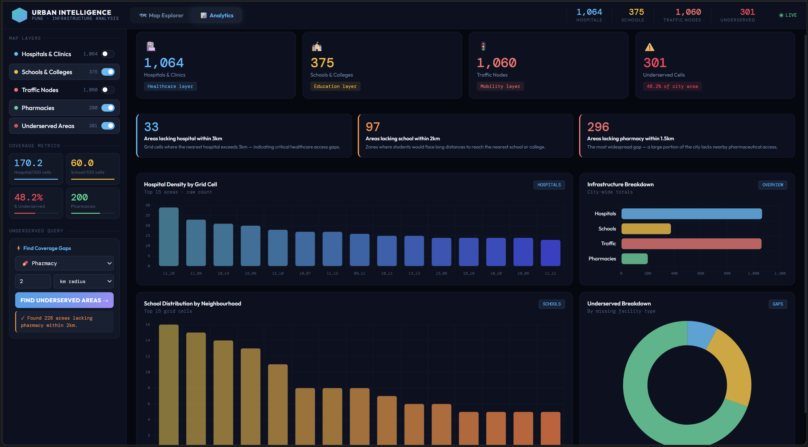

# 🏙️ Urban Intelligence Dashboard — Pune

> An interactive web application for analysing urban infrastructure density, distribution, and coverage gaps across Pune city using real OpenStreetMap data.

Built as part of the **Coriolis Technologies Internship Evaluation — Summer 2025**

---

## 📌 Problem Statement

Cities often lack visibility into how infrastructure is distributed across different neighbourhoods. This dashboard addresses the question:

> **"Which areas in Pune lack sufficient access to hospitals, schools, and pharmacies?"**

By collecting, processing, and visualising real infrastructure data, the dashboard enables planners and analysts to identify underserved zones and understand city-wide infrastructure density at a glance.

---

## 🗂️ Project Architecture

```
urban-intelligence-dashboard/
│
├── backend/
│   ├── data_collection/
│   │   └── fetch_osm_data.py        # Collects data from OpenStreetMap Overpass API
│   ├── data_processing/
│   │   └── process_data.py          # Cleans, grids, computes density & detects gaps
│   ├── data/
│   │   ├── pune_hospitals.json      # Raw collected data (gitignored)
│   │   ├── pune_schools.json
│   │   ├── pune_traffic_nodes.json
│   │   ├── pune_buildings.json
│   │   ├── pune_pharmacies.json
│   │   └── processed/               # Cleaned + analysed outputs (gitignored)
│   ├── app.py                       # Flask REST API — 7 endpoints
│   └── requirements.txt
│
└── frontend/
    ├── index.html                   # HTML structure
    ├── css/
    │   └── styles.css               # All styling and design tokens
    ├── js/
    │   ├── config.js                # API URL, colours, constants
    │   ├── map.js                   # Leaflet map, layers, markers, popups
    │   ├── sidebar.js               # KPI cards, view switching
    │   ├── query.js                 # Underserved area query feature
    │   ├── charts.js                # All Chart.js chart definitions
    │   └── app.js                   # Boot orchestrator
    └── assets/
        └── screenshots/
```

---

## 📊 Data Sources

| Source | What we used |
|--------|-------------|
| [OpenStreetMap](https://www.openstreetmap.org/) | Base map tiles |
| [Overpass API](https://overpass-api.de/) | Hospitals, schools, traffic signals, buildings, pharmacies |
| [Open Government Data Platform India](https://data.gov.in/) | Reference for administrative boundaries |

All data is fetched programmatically — no manual downloads required. Running `fetch_osm_data.py` rebuilds the entire dataset from scratch.

---

## 🔢 Dataset Summary (Pune)

| Category | Records |
|----------|--------:|
| Hospitals & Clinics | 1,064 |
| Schools & Colleges | 375 |
| Traffic Nodes | 1,060 |
| Buildings | 230,583 |
| Pharmacies | 200 |
| **Total** | **233,282** |

---

## 🧠 Key Analysis Results

The city is divided into a **25×25 grid** (~1.1 km × 1.1 km per cell). For each cell we compute:

- Infrastructure count and density score per category
- Distance to nearest hospital, school, and pharmacy
- An **underservice score** (weighted gap metric)

| Metric | Result |
|--------|--------|
| Grid cells with no hospital within 3km | 33 |
| Grid cells with no school within 2km | 97 |
| Grid cells with no pharmacy within 1.5km | 296 |
| **Total underserved cells (any gap)** | **301 (48.2% of city grid)** |

---

## 🚀 Setup & Installation

### Prerequisites
- Python 3.9+
- Git

### 1. Clone the repository
```bash
git clone https://github.com/YOUR_USERNAME/urban-intelligence-dashboard.git
cd urban-intelligence-dashboard
```

### 2. Create and activate virtual environment
```bash
python -m venv venv

# Windows
venv\Scripts\activate

# Mac / Linux
source venv/bin/activate
```

### 3. Install backend dependencies
```bash
cd backend
pip install -r requirements.txt
```

### 4. Collect data from OpenStreetMap
```bash
cd data_collection
python fetch_osm_data.py
```
This fetches ~233k records from the Overpass API. Takes 3–5 minutes.
The script is **resumable** — if interrupted, re-running it skips already-fetched categories.

### 5. Process the data
```bash
cd ../data_processing
python process_data.py
```
Cleans, grids, computes density, and detects underserved areas. Outputs to `backend/data/processed/`.

### 6. Start the backend API
```bash
cd ..
python app.py
```
API is now running at `http://localhost:5000`

### 7. Serve the frontend
Open a new terminal in the project root:
```bash
cd frontend
python -m http.server 3000
```
Open **`http://localhost:3000`** in your browser.

---

## 🔌 API Reference

Base URL: `http://localhost:5000/api`

| Method | Endpoint | Description |
|--------|----------|-------------|
| `GET` | `/health` | Backend health check + data file status |
| `GET` | `/city/stats` | City-level summary statistics |
| `GET` | `/infrastructure/<category>` | Point data for hospitals / schools / traffic_nodes / buildings / pharmacies |
| `GET` | `/grid` | Full 25×25 grid with density scores |
| `GET` | `/underserved?type=hospital` | Underserved cells filtered by facility type |
| `GET` | `/query/underserved?facility=hospital&radius_km=3` | **Bonus feature** — dynamic gap query |
| `GET` | `/summary/by-area?category=hospitals&top_n=15` | Infrastructure count per area for charts |

### Example — Find areas lacking hospitals within 3km
```
GET /api/query/underserved?facility=hospital&radius_km=3
```
```json
{
  "query": "Areas lacking hospital within 3.0 km",
  "facility": "hospital",
  "radius_km": 3.0,
  "total_underserved_cells": 33,
  "results": [...]
}
```

---

## 🖥️ Dashboard Features

### 🗺️ Map Explorer
- Interactive Leaflet map centred on Pune
- 5 toggleable infrastructure layers (hospitals, schools, traffic, pharmacies, underserved zones)
- Click any marker for a popup with name, address, phone, and opening hours
- Underserved zones rendered as semi-transparent red grid overlays

### 📊 Analytics Tab
- 4 animated KPI cards with city-wide counts
- 3 insight cards showing specific infrastructure gap numbers
- Hospital density bar chart (top 15 grid cells)
- School distribution bar chart (top 15 grid cells)
- Infrastructure comparison (horizontal bar)
- Underserved breakdown by facility type (doughnut chart)

### ⚡ Underserved Area Query (Bonus Feature)
- Select any facility type (hospital / school / pharmacy)
- Set a custom radius in km
- Dashboard instantly redraws the map showing only areas beyond that threshold
- Each zone popup shows the nearest facility distance and the gap

---

## 👥 Division of Work

| Student | Responsibilities |
|---------|-----------------|
| **Dhruv** | Data collection pipeline, data processing & analysis, Flask backend API, underserved detection algorithm |
| **Rajveer** | Frontend web application, interactive map, charts & analytics dashboard, frontend–backend integration |

---

## 🛠️ Tech Stack

| Layer | Technology |
|-------|-----------|
| Data collection | Python, Requests, OpenStreetMap Overpass API |
| Data processing | Python, Pandas, math (Haversine distance) |
| Backend | Flask, Flask-CORS |
| Frontend map | Leaflet.js |
| Frontend charts | Chart.js |
| Fonts | Google Fonts (Outfit, DM Mono) |
| Version control | Git + GitHub |

---

## 📸 Screenshots

> 

> 

---

## 📄 License

This project was built for educational and evaluation purposes.

---

*Built with ❤️ for Coriolis Technologies Internship Evaluation — 2025*
